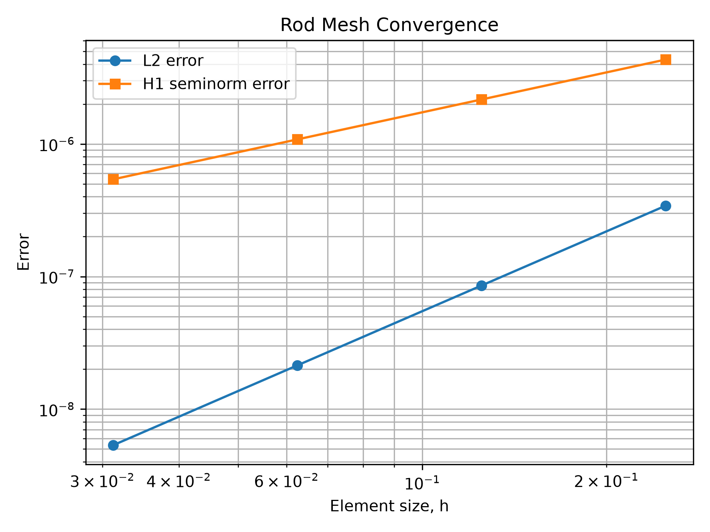
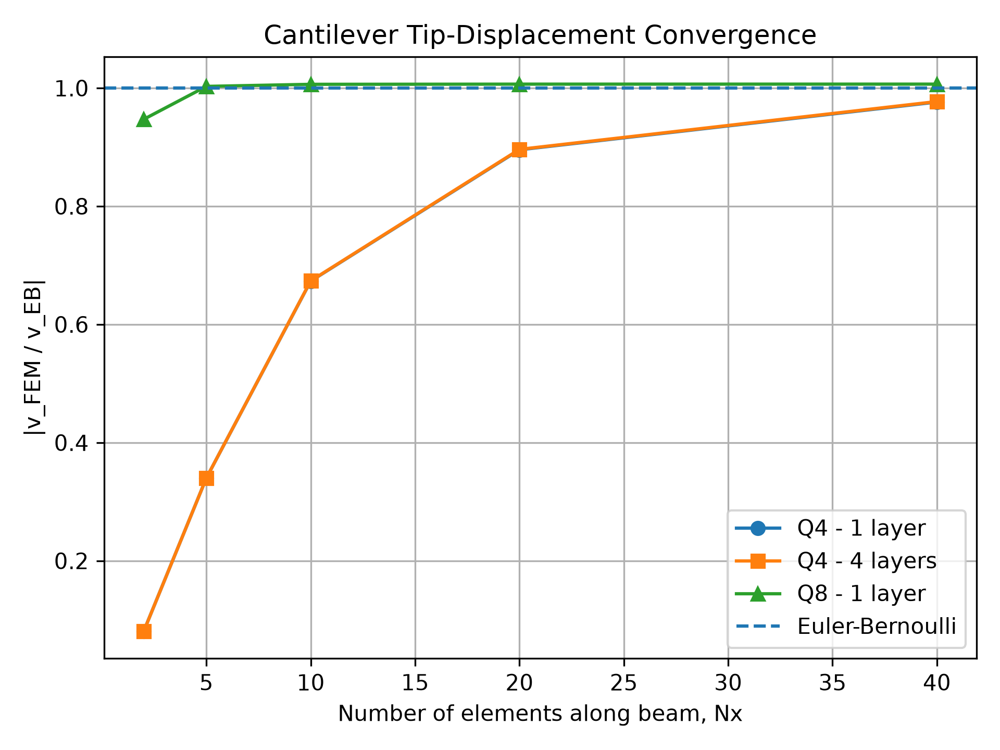
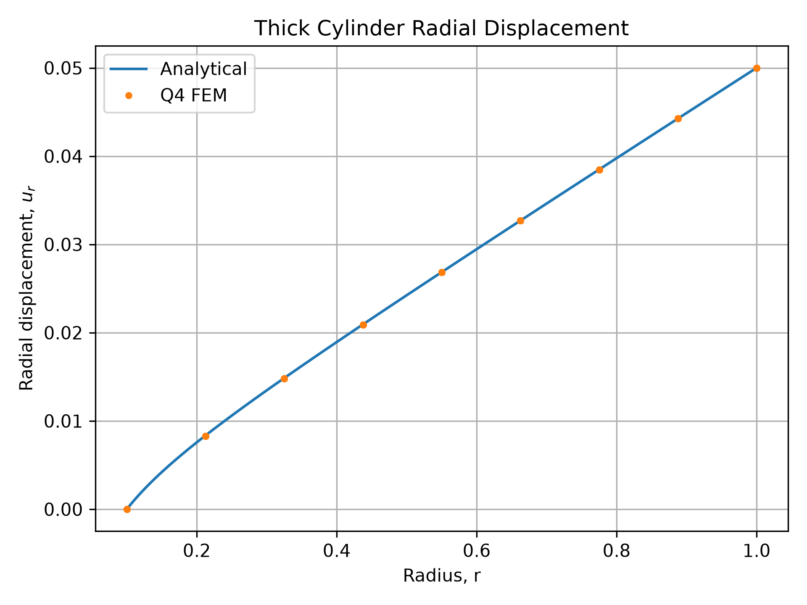
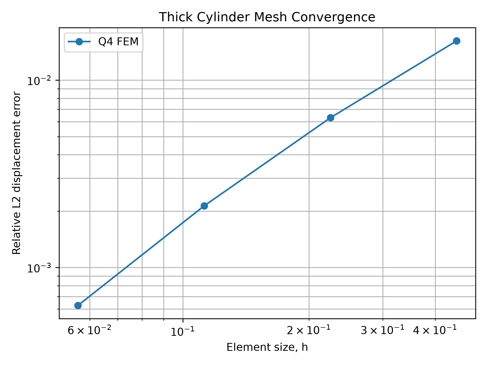
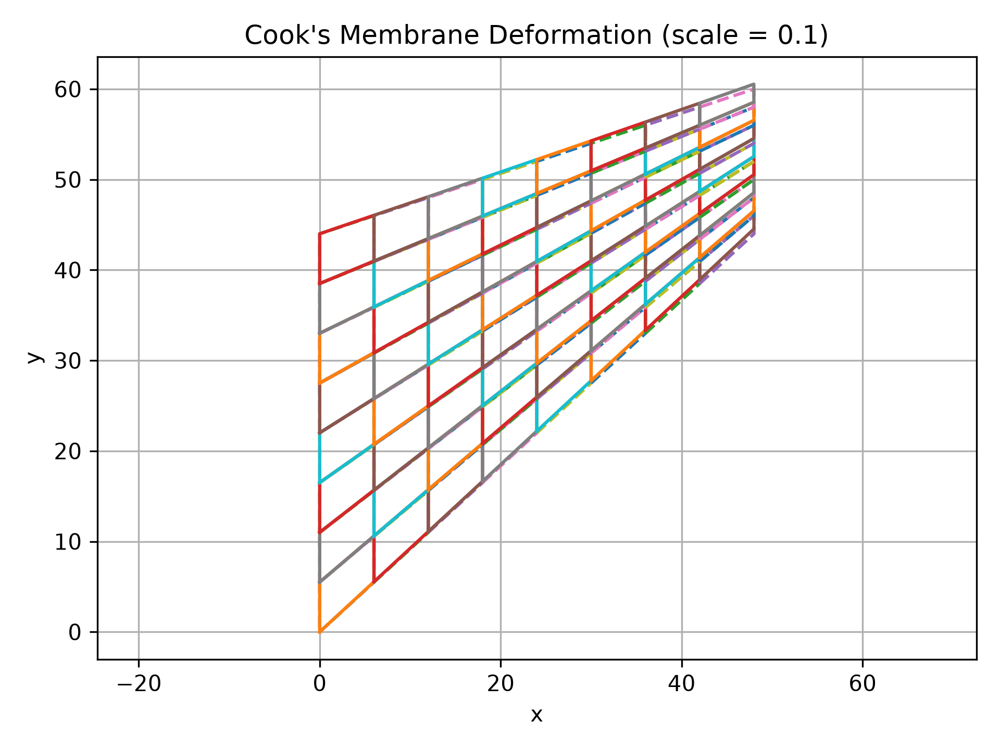
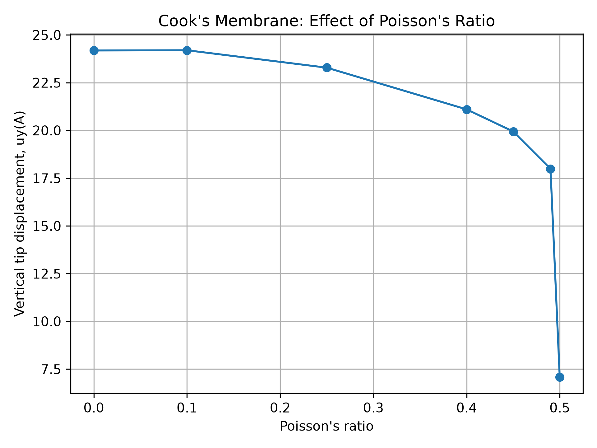

# Finite Element Solver for Linear Elasticity

**Ihina Mahajan**  
Ph.D. Student, Materials Science and Engineering  
University of Houston

A finite element method (FEM) solver for linear elasticity developed in Python.

This project implements the main components of a finite element solver from the ground up, including element-level formulation, numerical integration, global assembly, boundary conditions, sparse solution, post-processing, and convergence analysis.

The solver is demonstrated on several benchmark elasticity problems using L2, Q4, and Q8 finite elements.

---

## Installation

Clone the repository:

```bash
git clone https://github.com/ihina17/fem-elasticity-solver.git
cd fem-elasticity-solver
```

Create a virtual environment:

```bash
python -m venv .venv
```

Activate the environment on Windows PowerShell:

```powershell
Set-ExecutionPolicy -Scope Process -ExecutionPolicy RemoteSigned
.\.venv\Scripts\Activate.ps1
```

Install the dependencies:

```bash
pip install -r requirements.txt
```

Run the complete test suite:

```bash
python -m pytest tests -v
```

---

## Project Structure

```text
fem-elasticity-solver/
│
├── src/
│   │
│   ├── fem/
│   │   ├── create_id.py
│   │   ├── gauss_quadrature.py
│   │   ├── shape_functions.py
│   │   └── Vector.py
│   │
│   ├── meshes/
│   │   ├── L2.py
│   │   ├── Q4.py
│   │   ├── Q8.py
│   │   ├── annulus_Q4.py
│   │   └── cooks_Q4.py
│   │
│   ├── physics_models/
│   │   ├── elasticity_driver.py
│   │   ├── elasticity_kernel.py
│   │   └── boundary_loads.py
│   │
│   └── error_calculation.py
│
├── problems/
│   ├── rod_self_weight.py
│   ├── cantilever_beam.py
│   ├── thick_cylinder.py
│   └── cooks_problem.py
│
├── tests/
├── figures/
├── README.md
├── requirements.txt
└── .gitignore
```

The code is separated into reusable FEM routines, mesh generators, physics-specific routines, benchmark problems, and verification tests.

---

## FEM Implementation

The solver follows the standard displacement-based finite element workflow:

```text
Mesh generation
      ↓
Element shape functions
      ↓
Gaussian quadrature
      ↓
Element stiffness and force vectors
      ↓
Global equation numbering
      ↓
Sparse global assembly
      ↓
Boundary conditions and external loads
      ↓
Linear system solution
      ↓
Displacement and stress recovery
      ↓
Error and convergence analysis
```

### Implemented capabilities

- L2 linear finite elements
- Q4 bilinear quadrilateral elements
- Q8 serendipity quadrilateral elements
- Numerical Gaussian quadrature
- Isoparametric element mapping
- Strain-displacement matrix construction
- Plane stress and plane strain constitutive models
- Sparse stiffness-matrix assembly
- Essential displacement boundary conditions
- Body-force loading
- Concentrated nodal loading
- Distributed boundary tractions
- Displacement and stress post-processing
- Analytical error calculations
- Mesh-refinement studies
- Automated verification with `pytest`

---

# Benchmark Problems

## 1. Rod Under Self-Weight

A one-dimensional elastic rod subjected to gravitational body force is used as the first verification problem.

The FEM displacement and stress are compared directly with the analytical solution. Mesh refinement is used to verify the expected convergence behavior of the linear element.

Run:

```bash
python -m problems.rod_self_weight
```

<p align="center">
  
</p>

---

## 2. Cantilever Beam

A two-dimensional cantilever beam subjected to gravity is used to study bending behavior and element performance.

The problem compares:

- Q4 elements with different mesh resolutions through the thickness
- Q8 quadratic elements
- FEM tip displacement with the Euler-Bernoulli beam solution

The example illustrates the difference between linear and higher-order elements in a bending-dominated problem.

Run:

```bash
python -m problems.cantilever_beam
```

<p align="center">
  
</p>

---

## 3. Thick Cylinder

A two-dimensional thick-cylinder boundary-value problem is solved using Q4 elements.

The numerical solution is compared with the analytical radial displacement solution. The example includes:

- annular mesh generation
- plane-stress elasticity
- prescribed displacement boundary conditions
- radial displacement recovery
- strain-energy calculation
- mesh convergence analysis

Run:

```bash
python -m problems.thick_cylinder
```

<table>
<tr>
<td align="center">

</td>
<td align="center">

</td>
</tr>
</table>

---

## 4. Cook's Membrane

Cook's membrane is used as a two-dimensional benchmark for distorted quadrilateral elements and nearly incompressible elasticity.

The implementation includes:

- a tapered Q4 mesh
- plane-strain elasticity
- distributed shear traction on the boundary
- hierarchical mesh refinement
- stress recovery
- variation of Poisson's ratio
- investigation of volumetric locking

As Poisson's ratio approaches the incompressible limit, the standard displacement-based Q4 formulation becomes artificially stiff. The numerical study captures this behavior through the tip-displacement response.

Run:

```bash
python -m problems.cooks_problem
```

<table>
<tr>
<td align="center">

</td>
<td align="center">

</td>
</tr>
</table>

---

## Verification

The solver includes automated tests for the main numerical components, including:

- shape functions
- Gaussian quadrature
- mesh generation
- equation numbering
- constitutive matrices
- element stiffness matrices
- rigid-body modes
- global assembly
- boundary traction integration
- analytical benchmark solutions
- complete FEM problem solutions

Run:

```bash
python -m pytest tests -v
```

---

## Tools

**Python · NumPy · SciPy · Matplotlib · Pytest**

---

## About

This repository was developed to build and verify a finite element solver for linear elasticity while exploring numerical behavior across one-dimensional elasticity, bending, two-dimensional boundary-value problems, higher-order elements, mesh convergence, and nearly incompressible materials.