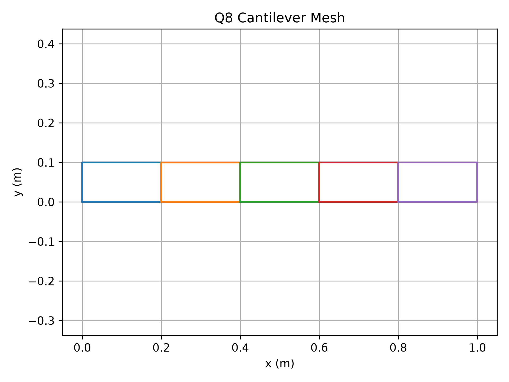
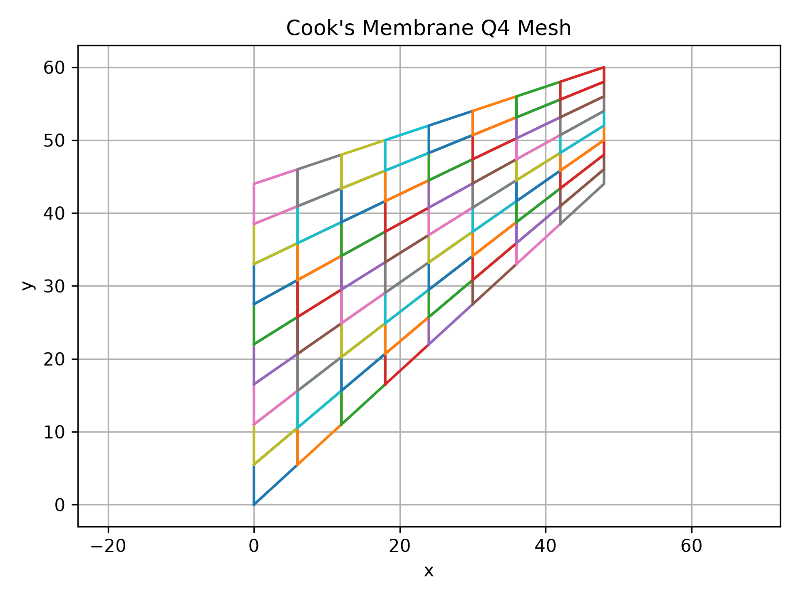

# Finite Element Solver for Linear Elasticity

**Ihina Mahajan**  
Ph.D. Student, Materials Science and Engineering  
University of Houston

A finite element method (FEM) solver for one- and two-dimensional linear elasticity problems developed in Python.

This project implements the main components of a finite element solver from the ground up, including mesh generation, shape functions, Gaussian quadrature, element matrices, sparse global assembly, boundary conditions, linear solution, stress recovery, and convergence analysis.

---

## About

The goal of this project is to build and verify a reusable finite element framework for linear elasticity rather than relying on a commercial FEM package.

The code is organized so that the core numerical routines are separated from the individual benchmark problems. This makes it possible to reuse the same FEM infrastructure across different geometries, element types, loading conditions, and constitutive assumptions.

The benchmark problems are used to test different numerical aspects of FEM, including analytical verification, bending response, higher-order interpolation, mesh convergence, distributed boundary loading, stress recovery, and nearly incompressible behavior.

---

## Installation

Clone the repository:

```bash
git clone https://github.com/ihina17/fem-elasticity-solver.git
cd fem-elasticity-solver
```

Create a virtual environment:

```bash
python -m venv .venv
```

Activate the environment on Windows PowerShell:

```powershell
Set-ExecutionPolicy -Scope Process -ExecutionPolicy RemoteSigned
.\.venv\Scripts\Activate.ps1
```

Install the dependencies:

```bash
pip install -r requirements.txt
```

Run the complete test suite:

```bash
python -m pytest tests -v
```

---

## Project Structure

```text
fem-elasticity-solver/
│
├── src/
│   │
│   ├── fem/
│   │   ├── create_id.py
│   │   ├── gauss_quadrature.py
│   │   ├── shape_functions.py
│   │   └── Vector.py
│   │
│   ├── meshes/
│   │   ├── L2.py
│   │   ├── Q4.py
│   │   ├── Q8.py
│   │   ├── annulus_Q4.py
│   │   └── cooks_Q4.py
│   │
│   ├── physics_models/
│   │   ├── elasticity_driver.py
│   │   ├── elasticity_kernel.py
│   │   └── boundary_loads.py
│   │
│   └── error_calculation.py
│
├── problems/
│   ├── rod_self_weight.py
│   ├── cantilever_beam.py
│   ├── thick_cylinder.py
│   └── cooks_problem.py
│
├── tests/
├── figures/
├── README.md
├── requirements.txt
└── .gitignore
```

The repository is separated into reusable FEM routines, mesh generators, elasticity models, benchmark problems, verification tests, and generated figures.

---

## FEM Implementation

The solver follows the standard displacement-based finite element workflow:

```text
Mesh generation
      ↓
Shape functions
      ↓
Gaussian quadrature
      ↓
Element stiffness and force vectors
      ↓
Global equation numbering
      ↓
Sparse global assembly
      ↓
Boundary conditions and external loads
      ↓
Linear system solution
      ↓
Displacement and stress recovery
      ↓
Error and convergence analysis
```

### Implemented Capabilities

- L2 linear elements
- Q4 bilinear quadrilateral elements
- Q8 serendipity quadrilateral elements
- Isoparametric mapping
- Gaussian quadrature
- Strain-displacement matrix construction
- Plane stress
- Plane strain
- Sparse stiffness-matrix assembly
- Prescribed displacement boundary conditions
- Body-force loading
- Concentrated nodal loads
- Distributed boundary tractions
- Displacement post-processing
- Stress recovery
- Analytical error calculations
- Mesh-refinement studies
- Automated verification with `pytest`

---

## Mesh Generation

The project includes mesh generators for multiple element types and geometries, including linear and quadratic quadrilateral elements and mapped meshes for non-rectangular domains.

<table>
<tr>
<td align="center">
<br>
<b>Q4 mesh</b>
</td>
<td align="center">
<br>
<b>Q8 mesh</b>
</td>
</tr>
</table>

<p align="center">
  <br>
  <b>Mapped Q4 mesh for Cook's membrane</b>
</p>

---

# Benchmark Problems

## 1. Rod Under Self-Weight

A one-dimensional elastic rod subjected to gravitational body force is used as the first verification problem.

The FEM displacement and stress are compared with the analytical solution, and mesh refinement is used to verify the convergence behavior of the linear element.

Run:

```bash
python -m problems.rod_self_weight
```

<p align="center">
  
</p>

---

## 2. Cantilever Beam

A two-dimensional cantilever beam subjected to gravity is used to study bending behavior and element performance.

The problem compares Q4 and Q8 elements and evaluates the FEM tip displacement against the Euler-Bernoulli beam solution.

The example highlights the improved bending performance of the higher-order Q8 element.

Run:

```bash
python -m problems.cantilever_beam
```

<p align="center">
  
</p>

---

## 3. Thick Cylinder

A two-dimensional thick-cylinder boundary-value problem is solved using Q4 elements.

The example includes:

- annular mesh generation
- plane-stress elasticity
- prescribed displacement boundary conditions
- radial displacement recovery
- strain-energy calculation
- analytical verification
- mesh convergence analysis

Run:

```bash
python -m problems.thick_cylinder
```

<table>
<tr>
<td align="center">

</td>
<td align="center">

</td>
</tr>
</table>

---

## 4. Cook's Membrane

Cook's membrane is used as a benchmark for distorted quadrilateral elements and nearly incompressible elasticity.

The implementation includes:

- tapered Q4 mesh generation
- plane-strain elasticity
- distributed shear traction
- hierarchical mesh refinement
- stress recovery
- variation of Poisson's ratio
- volumetric-locking analysis

As the material approaches the incompressible limit, the standard displacement-based Q4 formulation becomes artificially stiff. The numerical study captures this behavior through the tip-displacement response.

Run:

```bash
python -m problems.cooks_problem
```

<table>
<tr>
<td align="center">

</td>
<td align="center">

</td>
</tr>
</table>

---

## Verification

The solver includes automated tests for the main numerical components, including:

- shape functions
- Gaussian quadrature
- mesh generation
- equation numbering
- constitutive matrices
- element stiffness matrices
- rigid-body modes
- sparse global assembly
- boundary traction integration
- analytical benchmark solutions
- complete FEM problem solutions

Run:

```bash
python -m pytest tests -v
```

---

## Scope and Future Extensions

The current solver focuses on small-strain, linear-elastic finite element analysis with L2, Q4, and Q8 elements.

Possible extensions include:

- triangular and higher-order two-dimensional elements
- three-dimensional elasticity
- nonlinear material models
- geometric nonlinearity
- mixed formulations for nearly incompressible elasticity
- reduced and selective integration
- adaptive mesh refinement
- transient and dynamic elasticity
- eigenvalue and vibration analysis
- more general traction and boundary-condition handling
- improved stress recovery and error estimation

The current framework is intended to provide a clear foundation for extending the solver toward more advanced computational mechanics problems.